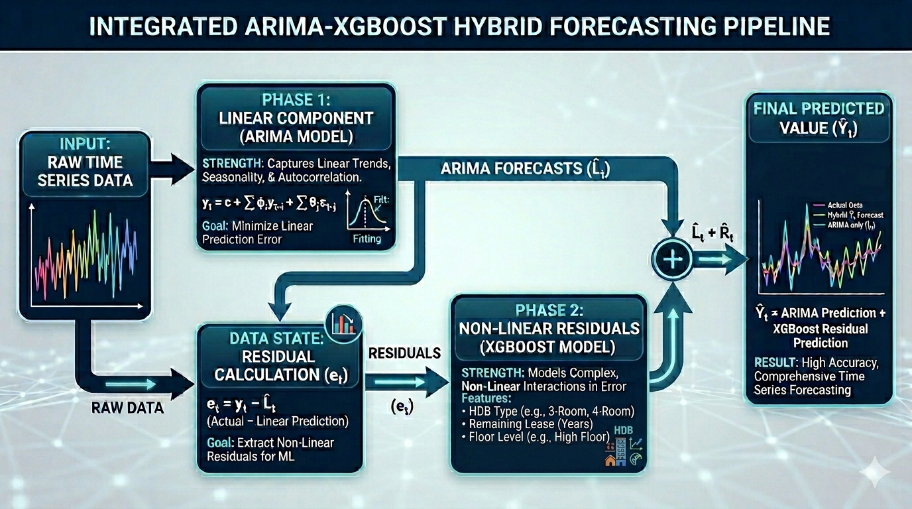

```{python}
#| echo: false
#| output: false
import sys
import subprocess
import warnings

# Remove all warnings
warnings.filterwarnings('ignore')

# Pin kagglehub to the compatible release; 1.0.1 can fail on kagglesdk imports.
try:
    import kagglehub
except ImportError:
    subprocess.check_call([sys.executable, "-m", "pip", "install", "kagglehub==0.3.12"])

# Ensure all other required packages are installed in the active Quarto environment
required_packages = {
    "xgboost": "xgboost",
    "statsmodels": "statsmodels",
    "seaborn": "seaborn",
    "sklearn": "scikit-learn",
    "bs4": "beautifulsoup4",
    "requests": "requests",
    "pmdarima": "pmdarima"
}
for import_name, package in required_packages.items():
    try:
        __import__(import_name)
    except ImportError:
        subprocess.check_call([sys.executable, "-m", "pip", "install", package])

```

# Introduction

Machine Learning, XGBoost seems pretty powerful right? However, it has been proven that XGBoost may be a little... insufficient for future prediction due to it being a tree based enemble method. As a Statistic major, the first thing that pop in my mind is do a hybrid of time series and ML. ARIMA is a common buzzword most stat majors learn, we do know that ARIMA often requires stationary data and it can often be acquire by getting the difference in data. In Statistics term, we call that Lag data. 

Now here is the catch, what if I use Lag data on XGBoost? Would the performance be better? We would answer this question in this blog to find out the best model to predict HDB pricing.

Here is a chart of how I am going to do this hybrid model to give everyone a better understanding. 



---

# XGBoost with Lag_1

```{python}
import kagglehub
import pandas as pd
import os

# import hdb price with time
# Download dataset
path = kagglehub.dataset_download("yingghui233/hdb-resale-pricing-singapore")

# Find csv name & make it a dataframe
files = os.listdir(path)
csv_file = os.path.join(path, files[0])
hdb = pd.read_csv(csv_file)
# print(hdb.head())

# make it datetime
hdb_ori = hdb.copy()
hdb['month'] = pd.to_datetime(hdb['month']).dt.to_period('M')

# group by town since its the most significant categorical variable
tw = hdb.groupby(['town','month'])['resale_price'].median().reset_index()
print(tw)

# get the lag_1 value
tw = tw.sort_values(['town','month'])
tw['Lag_1'] = tw.groupby('town')['resale_price'].shift(1)
hdb_merged = hdb.merge(
    tw[['town','month','Lag_1']],
    on=['town','month'],
    how='left'
)
hdb_merged['Lag_1'] = hdb_merged['Lag_1'].fillna(hdb_merged.groupby('town')['Lag_1'].transform('first'))
print(hdb_merged)
```
```{python}
# using XGBoost model with the addition of the cost from the previous month (differentiated by town)
# Create a 'year' and 'month_num' column
hdb_merged['year'] = hdb_merged['month'].dt.year

# convert remaining_lease into a pure numerical number
hdb_merged['remaining_lease'] = hdb_merged['remaining_lease'].str.extract('(\d+)').astype(float)

# use the midpoint of storey
hdb_merged['storey_mid'] = hdb_merged['storey_range'].apply(lambda x: (int(x.split(' TO ')[0]) + int(x.split(' TO ')[1])) / 2)

# check new features
print(hdb_merged[['year','town', 'flat_type', 'storey_mid', 'remaining_lease','Lag_1','floor_area_sqm','resale_price']].head())
hdb_df = hdb_merged[['year','town', 'flat_type', 'storey_mid', 'remaining_lease','Lag_1','floor_area_sqm','resale_price']]
```

```{python}
from sklearn.model_selection import train_test_split
import numpy as np
from sklearn.metrics import r2_score, mean_squared_error
from xgboost import XGBRegressor
from xgboost import plot_importance
import matplotlib.pyplot as plt

# split your data (80% training, 20% testing), only take the first 80% as time matters here
X = pd.get_dummies(hdb_df[['year', 'storey_mid', 'remaining_lease', 'town', 'flat_type','floor_area_sqm','Lag_1']]) # do ohe for town
y = np.log1p(hdb_df['resale_price'])
X_train, X_test, y_train, y_test = train_test_split(X, y, test_size=0.2, shuffle=False)

xgb = XGBRegressor(colsample_bytree= 0.8, learning_rate= 0.1, max_depth= 10, n_estimators= 400, subsample= 1.0,random_state=42, n_jobs=-1)
xgb.fit(X_train, y_train)

# predict and get r^2, rmse
xgb_preds = xgb.predict(X_test)

# reverse log transformation for both actual and predicted get r^2
true_y_test_sqm = np.expm1(y_test)
true_preds_sqm = np.expm1(xgb_preds)
print(f"XGBoost R^2: {r2_score(true_y_test_sqm, true_preds_sqm):.4f}")

rmse_sqm = np.sqrt(mean_squared_error(true_y_test_sqm, true_preds_sqm))
print(f"True XGBoost RMSE: {rmse_sqm:.2f}")
```

```{python}
# 1. Match your predictions back to the original dates
test_df = hdb_merged.loc[X_test.index].copy()
test_df['Actual'] = true_y_test_sqm
test_df['Predicted'] = true_preds_sqm

# 2. Group by month so it becomes a clean line
plot_data = test_df.groupby('month')[['Actual', 'Predicted']].median().reset_index()
plot_data['month'] = plot_data['month'].dt.to_timestamp() # Fixes date formatting for matplotlib

# 3. Just plot the damn thing!
plt.figure(figsize=(12, 5))
plt.plot(plot_data['month'], plot_data['Actual'], label='Actual Price', color='green', marker='o')
plt.plot(plot_data['month'], plot_data['Predicted'], label='Predicted Price', color='red', linestyle='--')
plt.legend()
plt.title("HDB True vs Predicted Trend")
plt.show()
```

Note that the table shows a general trend (median value each month).

# What is SARIMA and how to find the parameters?

A SARIMA (Seasonal Autoregressive Integrated Moving Average) model is an extension of the ARIMA model that incorporates seasonality.

**Key Components of SARIMA**

- **Autoregressive (AR) terms**: Represented by $ p $, these terms account for the relationship between an observation and a number of lagged observations.
- **Integrated (I) terms**: Represented by $ d $, these terms indicate the number of differencing operations needed to make the time series stationary.
- **Moving Average (MA) terms**: Represented by $ q $, these terms model the relationship between an observation and a residual error from a moving average model applied to lagged observations.

**Seasonal Components**

- **Seasonal Autoregressive (SAR) terms**: Represented by $ P $, these terms account for the seasonal autoregression.
- **Seasonal Integrated (SI) terms**: Represented by $ D $, these terms indicate the number of seasonal differencing operations.
- **Seasonal Moving Average (SMA) terms**: Represented by $ Q $, these terms account for the seasonal moving average.
- **Seasonal Period (S)**: This represents the number of time steps for a single seasonal period (e.g., 12 for monthly data with yearly seasonality).

**Notation**

A SARIMA model is usually denoted as:

$$ SARIMA(p, d, q) \times (P, D, Q)_S $$

_Where:_
- $ p $: Non-seasonal autoregressive order
- $ d $: Non-seasonal differencing order
- $ q $: Non-seasonal moving average order
- $ P $: Seasonal autoregressive order
- $ D $: Seasonal differencing order
- $ Q $: Seasonal moving average order
- $ S $: Length of the seasonal cycle

_Example_

$$ SARIMA(1, 1, 1) \times (1, 1, 1)_{12} $$

---

```{python}
# ARIMA
# EDA

import numpy as np
import pandas as pd
import matplotlib.pyplot as plt

from statsmodels.tsa.stattools import adfuller, kpss
from statsmodels.graphics.tsaplots import plot_acf, plot_pacf

# Keep only the columns we need (dropping town since we are aggregating)
tw_subset = tw[['month', 'resale_price']].copy()
tw_indexed = tw_subset.set_index('month')

# Group by month to get the overall mean across all towns,
# then resample to 'M' (Month End) to ensure a perfectly regular time-series grid
tw_cleaned_df = (
    tw_subset
    .groupby('month')['resale_price']
    .mean()
    .resample('M')
    .mean()
    .to_frame()
)

# Just in case there is a historical month with zero transactions
tw_cleaned_df['resale_price'] = tw_cleaned_df['resale_price'].interpolate(method='linear')
tw_cleaned_df.index = tw_cleaned_df.index.to_timestamp()
print(tw_cleaned_df)
```

To find the parameters in the old school way, we can manually find the first difference, get the results of the ADF test, have the ACF and PACF plots and analyse the plots accordingly. ADF test is used to test if data is stationary which is important before modelling ARIMA. The plan to find the optimal parameters is as stated below.

Create 3 versions of the time series data:
- original
- 1st diff .diff(1)
- time difference by the same month of the previous year .diff(12)

For each of those 3 time series preform the following tasks:

- Create a histogram plot of the values
- Create a line plot 1 weeks worth of the time series
- Create the ACF and PACF plots
- Print out the results of an Augmented Dickey-Fuller (ADF) test

```{python}
import matplotlib.pyplot as plt
from statsmodels.graphics.tsaplots import plot_acf, plot_pacf
from statsmodels.tsa.stattools import adfuller

amk_df = tw_cleaned_df.copy()

# Define the 3 versions
versions = {
    "Original": tw_cleaned_df['resale_price'],
    "1st Difference": tw_cleaned_df['resale_price'].diff(1),
    "Seasonal Difference (yearly)": tw_cleaned_df['resale_price'].diff(12)
}

for name, series in versions.items():
  # remove na vals
  clean_series=series.dropna()

  #histogram
  plt.figure(figsize=(8, 4))
  clean_series.hist(bins=50)
  plt.title(f"Histogram: {name}")
  plt.show()

  # line plot(3 years)
  plt.figure(figsize=(12, 4))
  clean_series.head(36).plot() # Plot first 3 years (36 months)
  plt.title(f"3 year line Plot: {name}")
  plt.show()

  # ACF and PACF (Lags = 48 to show 2 full days)
  fig, axes = plt.subplots(1, 2, figsize=(15, 4))
  plot_acf(clean_series, lags=48, ax=axes[0])
  plot_pacf(clean_series, lags=48, ax=axes[1])
  axes[0].set_title(f"ACF: {name}")
  axes[1].set_title(f"PACF: {name}")
  plt.show()

  # ADF Test
  result = adfuller(clean_series)
  print(f'ADF Statistic: {result[0]}')
  print(f'p-value: {result[1]}')
  if result[1] < 0.05:
    print("Conclusion: Stationarity confirmed (Reject Null Hypothesis)")
  else:
    print("Conclusion: Non-Stationary (Fail to Reject Null Hypothesis)")
```

Criteria in looking at ACF ad PACF plots for SARIMA parameters

1. Identifying Autoregressive Model (AR)
- PACF cuts off sharply after a specific number of lags (p)
- Tails off gradually for ACF plot
- eg if PACF plot has tall bars at Lag 1 and 2 but not 3 onwards (in light blue zone), and ACF trickles down, its ARIMA(2,d,0)


2. Identifying Moving Average (MA)
- ACF cuts off sharply after number of lags (q)
- PACF tails off gradually (downward steady slope/decay)

Hence, for the AMK dataset, I would be using the first difference since it has the smallest p-value from ADF test (d=1).

The parameters would be ARIMA(2,1,2). PACF has a sharp early cluster, significant negative spikes at Lag 1 and 2, p=2. ACF have significant Lag 1 and 2, q = 2.

For Seasonal Components (P,D,Q)s:
Looking at seasonal mutiples, for monthly data, check for Lags 12,24, and 36.

Seasonal AR ($P$): If the PACF shows a significant spike at exactly Lag 12 and then cuts off at Lag 24, while the ACF shows a slow decay at lags 12, 24, and 36 $\rightarrow$ Set $P = 1, Q = 0$.

Seasonal MA ($Q$): If the ACF shows a significant spike at exactly Lag 12 and cuts off, while the PACF shows a slow decay at those milestones $\rightarrow$ Set $P = 0, Q = 1$.

In this case, PACF and ACF do not show any significant spike at Lag 12, 24, and 36.

Hence, the final time series model we have is
SARIMA(2,1,2) x (0,0,0)12.

# Difference between old school way and grid search???

The above is kind of like the old school way to find the parameters. However, after using grid search, we found that the most optimal model is SARIMA(0,1,0) x (0,0,0)12, since it has the lowest AIC among the rest.

The model that we got may be highly subjective and prone to overfitting, its AIC value is Inf supporting the overfitting suspicion. Hence, we will use SARIMA(0,1,0) x (0,0,0)12.

```{python}
# find optimal parameters using grid search
import pmdarima as pm
from pmdarima.model_selection import train_test_split

# train the first 80% of data
train, test = train_test_split(amk_df, train_size=80)

model = pm.auto_arima(
    train,
    start_p=0, max_p=3,       # Non-seasonal AR terms (testing lags 1, 2, 3)
    d=1,                      # Regular differencing (matching your 1st Diff plot)
    start_q=0, max_q=3,       # Non-seasonal MA terms

    start_P=0, max_P=1,       # Seasonal AR (keeping it low since lag 12 is dead)
    D=0,                      # Seasonal differencing (0 because 1st diff fixed it)
    max_Q=1,                  # Seasonal MA
    m=12,                     # Monthly seasonal cycle

    seasonal=True,            # Look for seasonal components
    stepwise=False,           # CRITICAL: False forces a full grid search instead of a shortcut
    approximation=False,      # CRITICAL: Calculates exact AIC rather than guessing
    trace=True,               # Prints out the AIC for every single model it tries
    error_action='ignore',    # Skips mathematically impossible combinations safely
    suppress_warnings=True
)

print(model.summary())
```

```{python}
# change period index to datetime timestamps
model.plot_diagnostics(figsize=(10,8))
import matplotlib.pyplot as plt
plt.show()
```

# Conclusion on ARIMA parameters

GridSearch suggests that (0,1,0),(0,0,
0) is the best model, which in this case is true compared to ARIMA(2,1,2) which is unstable.

# XGBoost on Residual

The next step is to get the residuals from the ARIMA model, train it using XGBoost in part 1 to create a hybrid time series + ML model.

$$\text{ARIMA Prediction} = Y_{t-1} + \text{Drift}$$

$$\text{Initial Residual} = \text{Actual} - (Y_{t-1} + \text{Drift})$$

Hence, we use the residuals as the target Y value using the XGBoost model we optimised in part 1.

I tried using ARIMA on price_per_sqm instead of resale price but it did not work out. Hence, for XGBoost, we will add floor_area_sqm as a numerical variable. 

```{python}
# Convert to datetime objects
hdb_ori['month'] = pd.to_datetime(hdb_ori['month'])

# convert remaining_lease into a pure numerical number
hdb_ori['remaining_lease'] = hdb_ori['remaining_lease'].astype(str).str.extract('(\d+)').astype(float)

# use the midpoint of storey
hdb_ori['storey_mid'] = hdb_ori['storey_range'].apply(lambda x: (int(x.split(' TO ')[0]) + int(x.split(' TO ')[1])) / 2)

# get the factors i want
hdb_final = hdb_ori[['month','town','storey_mid','remaining_lease','flat_type','floor_area_sqm','resale_price']]

# get residuals from ARIMA model
fitted = model.fittedvalues().to_frame(name='fitted').reset_index()

# merge on month
hdb_full = pd.merge(hdb_final,fitted,on='month',how='left')
hdb_full['resid'] = hdb_full['resale_price']-hdb_full['fitted']

# those with resid NA values are testing set
from sklearn.metrics import r2_score, mean_squared_error
hdb_sub = hdb_full.dropna()
X_train = pd.get_dummies(hdb_sub[['storey_mid', 'remaining_lease', 'town', 'flat_type','floor_area_sqm']]) # do ohe for town
y_train = hdb_sub['resid']

# those with resid=NA are test set
hdb_test = hdb_full[hdb_full['fitted'].isna()]
X_test = pd.get_dummies(hdb_test[['storey_mid', 'remaining_lease', 'town', 'flat_type','floor_area_sqm']]) # do ohe for town
# print(hdb_test)

# train using xgboost
xgb = XGBRegressor(colsample_bytree= 0.8, learning_rate= 0.1, max_depth= 10, n_estimators= 400, subsample= 1.0,random_state=42, n_jobs=-1)
xgb.fit(X_train,y_train)

# predict using xgb (residuals)
xgb_pred = xgb.predict(X_test)
print(xgb_pred)
pred_df = model.predict(31).rename_axis('month').reset_index(name='arima_pred')
hdb_test['xgb_pred'] = xgb_pred
print(hdb_test)

# merge hdb_test with pred_df on month, then get arima_pred + xgb_pred 
predicted_df = pd.merge(hdb_test, pred_df, on='month',how='right')
predicted_df['y_test'] = predicted_df['xgb_pred'] + predicted_df['arima_pred']
print(predicted_df[['month','resale_price','y_test']])
```

```{python}
# find the r^2 and rmse
print(f'ARIMA + XGBoost R^2: {r2_score(predicted_df['resale_price'],predicted_df['y_test']):.4f}')
print(f"ARIMA + XGBoost RMSE: {np.sqrt(mean_squared_error(predicted_df['resale_price'], predicted_df['y_test'])):.2f}")
```

```{python}
# Group by month so it becomes a clean line
plot_data = predicted_df.groupby('month')[['resale_price', 'y_test']].median().reset_index()
#plot_data['month'] = plot_data['month'].dt.to_timestamp() # Fixes date formatting for matplotlib

# Just plot the damn thing!
plt.figure(figsize=(12, 5))
plt.plot(plot_data['month'], plot_data['resale_price'], label='Actual Price', color='green', marker='o')
plt.plot(plot_data['month'], plot_data['y_test'], label='Predicted Price', color='red', linestyle='--')
plt.legend()
plt.title("HDB True vs Predicted Trend")
plt.show()
```

# Overall Conclusion

It is evident that the ARIMA + XGBoost hybrid model performs better than the XGBoost model with only a Lag_1 feature, as it achieved a higher R² and lower RMSE. This result is expected because ARIMA is able to capture the linear temporal patterns in the time series, while XGBoost can model the nonlinear relationships present in the residuals.

One limitation of ARIMA is that it requires the time series to be stationary. Initially, price_per_sqm was considered as the target variable. However, ADF tests showed that the series remained non-stationary even after applying first-order and seasonal differencing. In contrast, the median resale_price series became stationary after differencing and was therefore more suitable for ARIMA modelling. As a result, median resale_price was selected as the target variable for the hybrid ARIMA-XGBoost model.

In the next blog, we will experiment with a more modern time series forecasting model, Prophet, and evaluate how it compares with our ARIMA-XGBoost hybrid approach. Beyond forecasting accuracy, we aim to build an interactive platform where users can estimate future HDB resale prices based on housing characteristics and their planned purchase date. This could serve as a practical financial planning tool, helping prospective homeowners make more informed decisions about when and what to buy.
