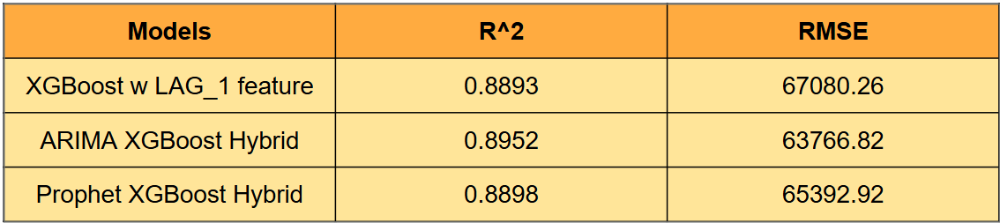

```{python}
#| echo: false
#| output: false
import sys
import subprocess
import warnings

# Remove all warnings
warnings.filterwarnings('ignore')

# Pin kagglehub to the compatible release; 1.0.1 can fail on kagglesdk imports.
try:
    import kagglehub
except ImportError:
    subprocess.check_call([sys.executable, "-m", "pip", "install", "kagglehub==0.3.12"])

# Ensure all other required packages are installed in the active Quarto environment
required_packages = {
    "xgboost": "xgboost",
    "statsmodels": "statsmodels",
    "seaborn": "seaborn",
    "sklearn": "scikit-learn",
    "bs4": "beautifulsoup4",
    "requests": "requests",
    "pmdarima": "pmdarima",
    "prophet": "prophet"
}
for import_name, package in required_packages.items():
    try:
        __import__(import_name)
    except ImportError:
        subprocess.check_call([sys.executable, "-m", "pip", "install", package])

```

# Introduction

With new models like Prophet being widely available especially in R and Python, I would like to evaluate whether it could outperform ARIMA, a traditional time series model. It is fully automated so no more manually looking at ACF and PACF (LOL gotta do that for my assignments in uni) and it captures trend and seasonality.

Similarly, as would train the data with prophet first, then get the residuals and use them in our XGBoost model. 

The rough equation of the model would be: 

$$\hat{y}^{\text{Hybrid}}_t = \hat{y}^{\text{Prophet}}_t + f_{\text{XGBoost}}(X_t)$$$$\hat{y}^{\text{Prophet}}_t = g(t) + s(t) + h(t)$$

---

# Prophet Time Series (training)

```{python}
import kagglehub
import pandas as pd
import os

# import hdb price with time
# Download dataset
path = kagglehub.dataset_download("yingghui233/hdb-resale-pricing-singapore")

# Find csv name & make it a dataframe
files = os.listdir(path)
csv_file = os.path.join(path, files[0])
hdb = pd.read_csv(csv_file)
# print(hdb.head())

# make it datetime
hdb_ori = hdb.copy()
hdb['month'] = pd.to_datetime(hdb['month']).dt.to_period('M')

tw = hdb.groupby(['month'])['resale_price'].median().reset_index()
print(tw)
```

```{python}
# clean data and find the datasets where there's no one month gap
tw['month'] = tw['month'].dt.to_timestamp()

# Create complete monthly index
full_months = pd.date_range(
    start=tw['month'].min(),
    end=tw['month'].max(),
    freq='MS')  # Month Start

tw = (tw.set_index('month')
      .reindex(full_months)
      .rename_axis('month')
      .reset_index())

print(tw[tw['resale_price'].isna()])
```

```{python}
from prophet import Prophet
import pmdarima as pm
from pmdarima.model_selection import train_test_split

# change the column name of tw to [ds,y]
twr = tw.rename(columns={'month':'ds','resale_price':'y'})
# use pmdarima to split the data for better comparison
train, test = train_test_split(twr, train_size=80)

# fit the train df into prophet
m = Prophet()
m.fit(train)

# predict the test set
test_date = test[['ds']]
forecast = m.predict(test_date)
print(forecast.head())

# plot the forecast
fig1 = m.plot(forecast)
fig2 = m.plot_components(forecast)
```

Overall trend suggest that price increases as time pass. We can observe that the standard deviation increases (blue shaded area). Prophet predictions provides the percentiles, which can definitely be used in many context. This is what ARIMA or LAG_1 XGBoost do not provide. 

Users may use the upper and lower prediction bounds to evaluate best-case and worst-case scenarios when making housing purchase decisions. This made Prophet more valuable compared to ARIMA hybrid model.

---

# XGBoost on Residuals

```{python}
# get the residuals from the train data, use xgboost 

# predict on training dates
train_forecast = m.predict(train[['ds']])
train_ds = train_forecast[['ds','yhat']]

# bring out hdb data, make it like prev 
hdb_ori = hdb.copy()
hdb_ori['ds'] = hdb_ori['month'].dt.to_timestamp()
hdb_ori['remaining_lease'] = hdb_ori['remaining_lease'].str.extract('(\d+)').astype(float)
hdb_ori['storey_mid'] = hdb_ori['storey_range'].apply(lambda x: (int(x.split(' TO ')[0]) + int(x.split(' TO ')[1])) / 2)
hdb_df = hdb_ori[['ds','town', 'flat_type', 'storey_mid', 'remaining_lease','floor_area_sqm','resale_price']]
# hdb_df.head()

# merge with the ori data & remove all wth na yhat (right df dh the date)
train_merged = hdb_df.merge(train_ds,on=['ds'],how='left').dropna(subset=['yhat'])
train_merged['residual'] = train_merged['resale_price']-train_merged['yhat']
train_merged.head()

# get test_merged
test_merged = hdb_df.merge(train_ds,on=['ds'],how='left')
test_merged = test_merged[test_merged.isna().any(axis=1)]
X_test = pd.get_dummies(test_merged[['town', 'flat_type', 'storey_mid', 'remaining_lease','floor_area_sqm']])
```

---

# Results

```{python}
from xgboost import XGBRegressor
from sklearn.metrics import r2_score, mean_squared_error
import numpy as np

# X_train and y_train
X_train = pd.get_dummies(train_merged[['town', 'flat_type', 'storey_mid', 'remaining_lease','floor_area_sqm']])
y_train = train_merged[['residual']]
xgb = XGBRegressor(colsample_bytree= 0.8, learning_rate= 0.1, max_depth= 10, n_estimators= 400, subsample= 1.0,random_state=42, n_jobs=-1)
xgb.fit(X_train,y_train)

# get the test data, add prophet predict with xgb predict
xgb_preds = xgb.predict(X_test)
test_merged['xgb_predict'] = xgb_preds

# merge with the prophet
prophet_test = forecast[['ds','yhat']]
test_merged_final = test_merged[['ds','town','flat_type','storey_mid','remaining_lease'	,'floor_area_sqm',	'resale_price',	'xgb_predict']].merge(prophet_test, on=['ds'],how='inner')
test_merged_final['total_predict'] = test_merged_final['xgb_predict'] + test_merged_final['yhat']

# get y_test and predictions
y_test = test_merged_final['resale_price']
predictions = test_merged_final['total_predict']

# get the r^2 and RMSE for the resale_price vs the total predicted price
print(f"R^2 Score for Prophet-XGBoost Hybrid: {r2_score(y_test, predictions):.4f}")
print(f"RMSE for Prophet-XGBoost Hybrid: {np.sqrt(mean_squared_error(y_test, predictions)):.2f}")
```

```{python}
import matplotlib.pyplot as plt

plot_data = test_merged_final.groupby('ds')[['resale_price','total_predict']].median().reset_index()
plt.figure(figsize=(12, 5))
plt.plot(plot_data['ds'], plot_data['resale_price'], label='Actual Price', color='green', marker='o')
plt.plot(plot_data['ds'], plot_data['total_predict'], label='Predicted Price', color='red', linestyle='--')
plt.legend()
plt.title("HDB True vs Predicted Trend")
plt.show()
```

---

# Comparing different models



As we can see, ARIMA_XGBoost Hybrid model performs the best, followed by Prophet_XGBoost hybrid model. This is quite unexpected as Prophet is often seen as a model that takes more factors into consideration like the general trend, seasonality, and holiday.

As mentioned previously, prophet have the benefit of evaluating best and worst case scenario. In order to add more depth, the streamlit dashboard will show prophet model prediction as well so that users have more options. Of course, as ARIMA_XGBoost works the best, that would be our main model used for prediction.